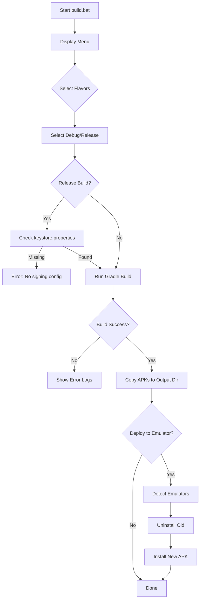

# APK Auto Build System - Implementation Plan

## Overview

This document outlines two build automation systems for VoidStream:
1. **Local Build Script** - Interactive Windows .bat for quick local builds and testing
2. **GitHub Actions Workflow** - Enterprise-grade CI/CD for automated releases

---

## Part 1: Local Build Script (`build.bat`)

### Purpose
Interactive Windows batch script for developers to quickly build, deploy, and test APKs locally without typing Gradle commands.

### Features

#### 1. Interactive Menu System
```
┌─────────────────────────────────────────┐
│   VoidStream APK Build Tool v1.0        │
└─────────────────────────────────────────┘

Select build flavors (space-separated numbers):
  [1] GitHub (sideload)
  [2] Amazon Appstore
  [3] Google Play Store
  [4] All flavors

Choice: _
```

#### 2. Build Configuration
- **Build type selection:**
  - `[1] Debug` - Fast builds, debuggable, no signing required
  - `[2] Release` - Optimized, signed, production-ready

- **Output directory:**
  - Default: `app/build/outputs/apk/`
  - Custom: User can specify path (e.g., `C:\Builds\VoidStream\`)
  - Creates directory if it doesn't exist

#### 3. Emulator Management
After build completes:
```
Build complete!

Emulator actions:
  [1] Install to running emulator
  [2] Uninstall old + Install new
  [3] Skip emulator deployment
  [4] List running emulators

Choice: _
```

Features:
- Detects running emulators via `adb devices`
- If multiple emulators, prompts for selection
- Uninstalls old version before installing new (prevents signature conflicts)
- Shows installation logs in real-time

#### 4. Build Process Flow



#### 5. Error Handling
- **No Android SDK:** Checks for `ANDROID_HOME` environment variable
- **No emulator running:** Prompts to start one or skip
- **Build failure:** Shows Gradle error output with line numbers
- **Keystore missing:** Shows helpful message with `keystore.properties.template` location
- **ADB not found:** Suggests adding SDK platform-tools to PATH

#### 6. Script Structure

```batch
@echo off
setlocal enabledelayedexpansion

REM ============================================
REM   VoidStream APK Build Tool
REM ============================================

:MAIN_MENU
cls
echo ========================================
echo   VoidStream APK Build Tool v1.0
echo ========================================
echo.
echo Select build flavors:
echo   [1] GitHub (sideload)
echo   [2] Amazon Appstore
echo   [3] Google Play Store
echo   [4] All flavors
echo.
set /p FLAVOR_CHOICE="Choice: "

REM Validate input
if "%FLAVOR_CHOICE%"=="1" set FLAVORS=github
if "%FLAVOR_CHOICE%"=="2" set FLAVORS=amazon
if "%FLAVOR_CHOICE%"=="3" set FLAVORS=googleplay
if "%FLAVOR_CHOICE%"=="4" set FLAVORS=github amazon googleplay

if not defined FLAVORS (
    echo Invalid choice. Press any key to try again...
    pause >nul
    goto MAIN_MENU
)

:BUILD_TYPE_MENU
cls
echo.
echo Select build type:
echo   [1] Debug (fast, debuggable)
echo   [2] Release (optimized, signed)
echo.
set /p BUILD_TYPE_CHOICE="Choice: "

if "%BUILD_TYPE_CHOICE%"=="1" set BUILD_TYPE=debug
if "%BUILD_TYPE_CHOICE%"=="2" set BUILD_TYPE=release

if not defined BUILD_TYPE (
    echo Invalid choice. Press any key to try again...
    pause >nul
    goto BUILD_TYPE_MENU
)

REM Check for keystore if release build
if "%BUILD_TYPE%"=="release" (
    if not exist "keystore.properties" (
        echo.
        echo ERROR: Release build requires keystore.properties
        echo Copy keystore.properties.template and fill in your values
        echo.
        pause
        exit /b 1
    )
)

:OUTPUT_DIR_MENU
cls
echo.
echo Output directory:
echo   [1] Default (app/build/outputs/apk/)
echo   [2] Custom path
echo.
set /p OUTPUT_CHOICE="Choice: "

if "%OUTPUT_CHOICE%"=="1" set OUTPUT_DIR=app\build\outputs\apk
if "%OUTPUT_CHOICE%"=="2" (
    set /p OUTPUT_DIR="Enter path: "
)

REM Create output directory if it doesn't exist
if not exist "%OUTPUT_DIR%" mkdir "%OUTPUT_DIR%"

:BUILD_APKS
cls
echo.
echo ========================================
echo   Building APKs...
echo ========================================
echo.
echo Flavors: %FLAVORS%
echo Build Type: %BUILD_TYPE%
echo Output: %OUTPUT_DIR%
echo.

REM Build each flavor
for %%f in (%FLAVORS%) do (
    echo Building %%f %BUILD_TYPE%...
    call gradlew.bat assemble%%f%BUILD_TYPE%

    if errorlevel 1 (
        echo.
        echo ERROR: Build failed for %%f
        echo Check the Gradle output above for details
        echo.
        pause
        exit /b 1
    )

    REM Copy APK to output directory
    echo Copying APK to %OUTPUT_DIR%...
    copy /Y "app\build\outputs\apk\%%f\%BUILD_TYPE%\*.apk" "%OUTPUT_DIR%\"
)

echo.
echo ========================================
echo   Build Complete!
echo ========================================
echo.

:EMULATOR_MENU
echo.
echo Emulator actions:
echo   [1] Install to running emulator
echo   [2] Uninstall old + Install new
echo   [3] List running emulators
echo   [4] Skip emulator deployment
echo.
set /p EMULATOR_CHOICE="Choice: "

if "%EMULATOR_CHOICE%"=="1" goto INSTALL_APK
if "%EMULATOR_CHOICE%"=="2" goto UNINSTALL_AND_INSTALL
if "%EMULATOR_CHOICE%"=="3" goto LIST_EMULATORS
if "%EMULATOR_CHOICE%"=="4" goto END

REM Invalid choice
echo Invalid choice. Press any key to try again...
pause >nul
goto EMULATOR_MENU

:LIST_EMULATORS
cls
echo.
echo Running emulators:
echo ========================================
adb devices -l
echo.
pause
goto EMULATOR_MENU

:UNINSTALL_AND_INSTALL
echo.
echo Uninstalling old version...
adb uninstall org.voidstream.androidtv
echo.
goto INSTALL_APK

:INSTALL_APK
echo.
echo Detecting emulators...
adb devices -l | findstr /C:"device" >nul
if errorlevel 1 (
    echo.
    echo ERROR: No emulator detected
    echo Start an emulator and try again
    echo.
    pause
    goto EMULATOR_MENU
)

REM Prompt for which APK to install
echo.
echo Select APK to install:
set APK_INDEX=1
for %%f in (%FLAVORS%) do (
    echo   [!APK_INDEX!] %%f %BUILD_TYPE%
    set /a APK_INDEX+=1
)
echo.
set /p APK_CHOICE="Choice: "

REM Map choice to flavor
set APK_INDEX=1
for %%f in (%FLAVORS%) do (
    if "!APK_INDEX!"=="%APK_CHOICE%" (
        set SELECTED_FLAVOR=%%f
    )
    set /a APK_INDEX+=1
)

if not defined SELECTED_FLAVOR (
    echo Invalid choice. Press any key to try again...
    pause >nul
    goto EMULATOR_MENU
)

REM Find the APK file
for %%i in ("%OUTPUT_DIR%\*%SELECTED_FLAVOR%*%BUILD_TYPE%*.apk") do (
    set APK_PATH=%%i
)

if not defined APK_PATH (
    echo.
    echo ERROR: APK not found in %OUTPUT_DIR%
    echo.
    pause
    goto EMULATOR_MENU
)

echo.
echo Installing %APK_PATH%...
adb install -r "%APK_PATH%"

if errorlevel 1 (
    echo.
    echo ERROR: Installation failed
    echo Try uninstalling the old version first
    echo.
    pause
    goto EMULATOR_MENU
)

echo.
echo Installation complete!
echo.
pause

:END
echo.
echo Done! APKs are in: %OUTPUT_DIR%
echo.
pause
exit /b 0
```

#### 7. Advanced Features

**Log Output:**
- Saves build logs to `build-logs/build-YYYYMMDD-HHMMSS.log`
- Includes timestamps for each step
- Shows Gradle daemon status

**Build Cache:**
- Uses `--build-cache` flag for faster subsequent builds
- Option to clean build (`[C] Clean build`) in menu

**Parallel Builds:**
- Builds multiple flavors in parallel using `--parallel`
- Shows progress for each flavor in separate console windows (optional)

**Version Detection:**
- Reads `gradle.properties` to show current version in menu
- Warns if building old version

---

## Part 2: GitHub Actions Workflow (Enterprise-Grade)

### Purpose
Automated, tested, production-ready CI/CD pipeline for building and releasing APKs without local builds.

### Architecture Overview

```
┌──────────────────────────────────────────────────────────────┐
│                    GitHub Actions Workflow                    │
├──────────────────────────────────────────────────────────────┤
│                                                               │
│  Trigger: Push tag (v*)                                       │
│                                                               │
│  ┌────────────────┐  ┌────────────────┐  ┌────────────────┐ │
│  │  Build GitHub  │  │  Build Amazon  │  │ Build G.Play   │ │
│  │    Flavor      │  │    Flavor      │  │    Flavor      │ │
│  │                │  │                │  │                │ │
│  │  - Lint        │  │  - Lint        │  │  - Lint        │ │
│  │  - Test        │  │  - Test        │  │  - Test        │ │
│  │  - Build APK   │  │  - Build APK   │  │  - Build AAB   │ │
│  │  - Sign        │  │  - Sign        │  │  - Sign        │ │
│  │  - Verify      │  │  - Verify      │  │  - Verify      │ │
│  └───────┬────────┘  └───────┬────────┘  └───────┬────────┘ │
│          │                   │                   │           │
│          └───────────────────┴───────────────────┘           │
│                              │                               │
│                    ┌─────────▼─────────┐                     │
│                    │  Create Release   │                     │
│                    │                   │                     │
│                    │  - Extract notes  │                     │
│                    │  - Upload assets  │                     │
│                    │  - Notify         │                     │
│                    └───────────────────┘                     │
│                                                               │
└──────────────────────────────────────────────────────────────┘
```

### Workflow Files

#### 1. Main Release Workflow (`.github/workflows/release.yaml`)

**Trigger Mechanism:**
```yaml
on:
  push:
    tags:
      - 'v*'           # v1.0.0, v2.1.3-beta
  workflow_dispatch:   # Manual trigger
    inputs:
      version:
        description: 'Version tag (e.g., v1.0.0)'
        required: true
        type: string
      prerelease:
        description: 'Mark as pre-release'
        required: false
        type: boolean
        default: false
```

**Key Features:**
- Parallel matrix builds for all 3 flavors
- Secure signing via GitHub Secrets
- Automatic release notes from commits
- Asset upload (APK + AAB)
- Checksum generation (SHA-256)
- Artifact retention (90 days)
- Failure notifications

#### 2. Build Matrix Strategy

```yaml
jobs:
  build:
    name: Build ${{ matrix.flavor }} APK
    runs-on: ubuntu-24.04
    strategy:
      fail-fast: false  # Continue other builds if one fails
      matrix:
        flavor: [github, amazon, googleplay]
        include:
          - flavor: github
            artifact_name: voidstream-androidtv-github
            build_aab: false
          - flavor: amazon
            artifact_name: voidstream-androidtv-amazon
            build_aab: false
          - flavor: googleplay
            artifact_name: voidstream-androidtv-googleplay
            build_aab: true   # Also build AAB for Play Store

    steps:
      - name: Checkout repository
        uses: actions/checkout@v4
        with:
          fetch-depth: 0  # Full history for version detection

      - name: Setup Android
        uses: ./.github/actions/setup-android

      - name: Decode keystore
        env:
          KEYSTORE_BASE64: ${{ secrets.RELEASE_KEYSTORE_BASE64 }}
        run: |
          echo "$KEYSTORE_BASE64" | base64 -d > release.keystore
          echo "Keystore decoded successfully"

      - name: Create keystore.properties
        env:
          KEYSTORE_PASSWORD: ${{ secrets.KEYSTORE_PASSWORD }}
          KEY_ALIAS: ${{ secrets.KEY_ALIAS }}
          KEY_PASSWORD: ${{ secrets.KEY_PASSWORD }}
        run: |
          cat > keystore.properties <<EOF
          storeFile=$(pwd)/release.keystore
          storePassword=$KEYSTORE_PASSWORD
          keyAlias=$KEY_ALIAS
          keyPassword=$KEY_PASSWORD
          EOF

      - name: Run unit tests
        run: |
          ./gradlew test${{ matrix.flavor }}ReleaseUnitTest \
            --parallel \
            --build-cache \
            --configuration-cache

      - name: Run lint
        run: |
          ./gradlew lint${{ matrix.flavor }}Release \
            --parallel \
            --build-cache \
            --configuration-cache

      - name: Build APK
        run: |
          ./gradlew assemble${{ matrix.flavor }}Release \
            --parallel \
            --build-cache \
            --configuration-cache \
            --stacktrace
        env:
          GRADLE_OPTS: -Xmx4096m -XX:MaxMetaspaceSize=1g

      - name: Build AAB (Google Play only)
        if: matrix.build_aab
        run: |
          ./gradlew bundle${{ matrix.flavor }}Release \
            --parallel \
            --build-cache \
            --configuration-cache \
            --stacktrace

      - name: Verify APK signature
        run: |
          APK_PATH=$(find app/build/outputs/apk/${{ matrix.flavor }}/release -name "*.apk" -type f | head -n 1)
          echo "Verifying signature for: $APK_PATH"

          # Check APK is signed
          jarsigner -verify -verbose -certs "$APK_PATH" | tee verify.log

          if ! grep -q "jar verified" verify.log; then
            echo "ERROR: APK signature verification failed"
            exit 1
          fi

          # Extract signer info
          apksigner verify --print-certs "$APK_PATH"

      - name: Generate checksums
        run: |
          cd app/build/outputs/apk/${{ matrix.flavor }}/release
          for file in *.apk; do
            sha256sum "$file" > "$file.sha256"
            echo "Generated checksum for $file:"
            cat "$file.sha256"
          done

          # AAB checksums (Google Play only)
          if [ "${{ matrix.build_aab }}" = "true" ]; then
            cd ../../../../bundle/${{ matrix.flavor }}Release
            for file in *.aab; do
              sha256sum "$file" > "$file.sha256"
              echo "Generated checksum for $file:"
              cat "$file.sha256"
            done
          fi

      - name: Upload APK artifact
        uses: actions/upload-artifact@v4
        with:
          name: ${{ matrix.artifact_name }}-apk
          path: |
            app/build/outputs/apk/${{ matrix.flavor }}/release/*.apk
            app/build/outputs/apk/${{ matrix.flavor }}/release/*.sha256
          retention-days: 90

      - name: Upload AAB artifact (Google Play only)
        if: matrix.build_aab
        uses: actions/upload-artifact@v4
        with:
          name: ${{ matrix.artifact_name }}-aab
          path: |
            app/build/outputs/bundle/${{ matrix.flavor }}Release/*.aab
            app/build/outputs/bundle/${{ matrix.flavor }}Release/*.sha256
          retention-days: 90

      - name: Upload test results
        if: always()
        uses: actions/upload-artifact@v4
        with:
          name: test-results-${{ matrix.flavor }}
          path: |
            **/build/reports/tests/**
            **/build/test-results/**
          retention-days: 14
```

#### 3. Release Creation Job

```yaml
  create-release:
    name: Create GitHub Release
    needs: build  # Wait for all builds to complete
    runs-on: ubuntu-24.04
    permissions:
      contents: write  # Required for creating releases

    steps:
      - name: Checkout repository
        uses: actions/checkout@v4
        with:
          fetch-depth: 0

      - name: Download all artifacts
        uses: actions/download-artifact@v4
        with:
          path: artifacts

      - name: Extract version from tag
        id: version
        run: |
          VERSION=${GITHUB_REF#refs/tags/}
          echo "version=$VERSION" >> $GITHUB_OUTPUT
          echo "Version: $VERSION"

      - name: Generate release notes
        id: release_notes
        run: |
          VERSION=${{ steps.version.outputs.version }}

          # Get previous tag
          PREV_TAG=$(git describe --tags --abbrev=0 $VERSION^ 2>/dev/null || echo "")

          if [ -z "$PREV_TAG" ]; then
            echo "First release, showing all commits"
            COMMITS=$(git log --pretty=format:"- %s (%h)" --no-merges)
          else
            echo "Generating changelog from $PREV_TAG to $VERSION"
            COMMITS=$(git log $PREV_TAG..$VERSION --pretty=format:"- %s (%h)" --no-merges)
          fi

          # Create release notes with flavor-specific download links
          cat > release-notes.md <<EOF
          # VoidStream $VERSION

          ## Changes

          $COMMITS

          ## Downloads

          ### GitHub (Sideloaded) Build
          - Includes OTA self-update system
          - Includes donate button
          - For Fire TV, Android TV, Nvidia Shield

          **APK:** \`voidstream-androidtv-$VERSION-github-release.apk\`

          ### Amazon Appstore Build
          - Amazon Appstore compliance
          - No OTA updates (managed by Amazon)
          - No donate button

          **APK:** \`voidstream-androidtv-$VERSION-amazon-release.apk\`

          ### Google Play Store Build
          - Google Play compliance
          - No OTA updates (managed by Google Play)
          - No donate button
          - Includes both APK and AAB formats

          **APK:** \`voidstream-androidtv-$VERSION-googleplay-release.apk\`
          **AAB:** \`voidstream-androidtv-$VERSION-googleplay-release.aab\`

          ## Verification

          All APKs include SHA-256 checksums (`.sha256` files). Verify before installing:

          \`\`\`bash
          sha256sum -c voidstream-androidtv-$VERSION-github-release.apk.sha256
          \`\`\`

          ## Installation

          See the [README](https://github.com/ToastyToast25/VoidStream-FireTV/blob/master/README.md) for installation instructions.
          EOF

          echo "Release notes generated"
          cat release-notes.md

      - name: Determine if prerelease
        id: prerelease
        run: |
          VERSION=${{ steps.version.outputs.version }}
          if [[ "$VERSION" =~ (alpha|beta|rc|RC) ]]; then
            echo "prerelease=true" >> $GITHUB_OUTPUT
            echo "This is a pre-release version"
          else
            echo "prerelease=false" >> $GITHUB_OUTPUT
            echo "This is a stable release"
          fi

      - name: Create GitHub Release
        uses: softprops/action-gh-release@v2
        with:
          tag_name: ${{ steps.version.outputs.version }}
          name: VoidStream ${{ steps.version.outputs.version }}
          body_path: release-notes.md
          prerelease: ${{ steps.prerelease.outputs.prerelease }}
          draft: false
          files: |
            artifacts/voidstream-androidtv-github-apk/*.apk
            artifacts/voidstream-androidtv-github-apk/*.sha256
            artifacts/voidstream-androidtv-amazon-apk/*.apk
            artifacts/voidstream-androidtv-amazon-apk/*.sha256
            artifacts/voidstream-androidtv-googleplay-apk/*.apk
            artifacts/voidstream-androidtv-googleplay-apk/*.sha256
            artifacts/voidstream-androidtv-googleplay-aab/*.aab
            artifacts/voidstream-androidtv-googleplay-aab/*.sha256
        env:
          GITHUB_TOKEN: ${{ secrets.GITHUB_TOKEN }}

      - name: Notify on success
        if: success()
        run: |
          echo "✅ Release ${{ steps.version.outputs.version }} created successfully"
          echo "URL: https://github.com/ToastyToast25/VoidStream-FireTV/releases/tag/${{ steps.version.outputs.version }}"

      - name: Notify on failure
        if: failure()
        run: |
          echo "❌ Release creation failed for ${{ steps.version.outputs.version }}"
          echo "Check workflow logs for details"
```

#### 4. Store-Specific Validation Jobs

**Amazon Compliance Check:**
```yaml
  validate-amazon:
    name: Validate Amazon Compliance
    needs: build
    runs-on: ubuntu-24.04

    steps:
      - name: Download Amazon APK
        uses: actions/download-artifact@v4
        with:
          name: voidstream-androidtv-amazon-apk

      - name: Check for prohibited permissions
        run: |
          APK=$(find . -name "*amazon*.apk" -type f)

          echo "Checking for REQUEST_INSTALL_PACKAGES..."
          if aapt dump permissions "$APK" | grep -q "REQUEST_INSTALL_PACKAGES"; then
            echo "❌ FAIL: REQUEST_INSTALL_PACKAGES found in Amazon build"
            exit 1
          fi

          echo "✅ PASS: No prohibited permissions found"

      - name: Check for FileProvider
        run: |
          APK=$(find . -name "*amazon*.apk" -type f)

          echo "Checking for FileProvider in manifest..."
          if aapt dump xmltree "$APK" AndroidManifest.xml | grep -q "FileProvider"; then
            echo "❌ FAIL: FileProvider found in Amazon build"
            exit 1
          fi

          echo "✅ PASS: No FileProvider found"

      - name: Verify BuildConfig flags
        run: |
          APK=$(find . -name "*amazon*.apk" -type f)

          echo "Extracting and decompiling BuildConfig..."
          unzip -q "$APK" -d extracted/

          # Check that IS_AMAZON_BUILD is true
          if ! grep -r "IS_AMAZON_BUILD.*true" extracted/; then
            echo "❌ FAIL: IS_AMAZON_BUILD is not set to true"
            exit 1
          fi

          echo "✅ PASS: BuildConfig flags correct for Amazon"
```

**Google Play Compliance Check:**
```yaml
  validate-googleplay:
    name: Validate Google Play Compliance
    needs: build
    runs-on: ubuntu-24.04

    steps:
      - name: Download Google Play APK
        uses: actions/download-artifact@v4
        with:
          name: voidstream-androidtv-googleplay-apk

      - name: Check for prohibited permissions
        run: |
          APK=$(find . -name "*googleplay*.apk" -type f)

          echo "Checking for REQUEST_INSTALL_PACKAGES..."
          if aapt dump permissions "$APK" | grep -q "REQUEST_INSTALL_PACKAGES"; then
            echo "❌ FAIL: REQUEST_INSTALL_PACKAGES found in Google Play build"
            exit 1
          fi

          echo "✅ PASS: No prohibited permissions found"

      - name: Check for FileProvider
        run: |
          APK=$(find . -name "*googleplay*.apk" -type f)

          echo "Checking for FileProvider in manifest..."
          if aapt dump xmltree "$APK" AndroidManifest.xml | grep -q "FileProvider"; then
            echo "❌ FAIL: FileProvider found in Google Play build"
            exit 1
          fi

          echo "✅ PASS: No FileProvider found"

      - name: Verify BuildConfig flags
        run: |
          APK=$(find . -name "*googleplay*.apk" -type f)

          echo "Extracting and decompiling BuildConfig..."
          unzip -q "$APK" -d extracted/

          # Check that IS_GOOGLE_PLAY_BUILD is true
          if ! grep -r "IS_GOOGLE_PLAY_BUILD.*true" extracted/; then
            echo "❌ FAIL: IS_GOOGLE_PLAY_BUILD is not set to true"
            exit 1
          fi

          echo "✅ PASS: BuildConfig flags correct for Google Play"
```

### Secrets Configuration

Required GitHub Secrets (Repository Settings → Secrets → Actions):

| Secret Name | Description | How to Generate |
|------------|-------------|-----------------|
| `RELEASE_KEYSTORE_BASE64` | Base64-encoded keystore file | `base64 -w 0 release.keystore` |
| `KEYSTORE_PASSWORD` | Keystore password | From `keystore.properties` |
| `KEY_ALIAS` | Key alias name | From `keystore.properties` |
| `KEY_PASSWORD` | Key password | From `keystore.properties` |

**Setup Commands:**
```bash
# 1. Encode keystore to base64
base64 -w 0 release.keystore > keystore.base64

# 2. Copy the output and add to GitHub Secrets as RELEASE_KEYSTORE_BASE64

# 3. Add other secrets from keystore.properties
cat keystore.properties
# Copy each value to GitHub Secrets
```

### Workflow Testing Strategy

#### 1. Pre-Deployment Testing
Before enabling for production tags:

**Test on a temporary branch:**
```yaml
# .github/workflows/release-test.yaml
on:
  push:
    branches:
      - test-release-workflow
```

**Steps:**
1. Create test branch: `git checkout -b test-release-workflow`
2. Push changes: `git push origin test-release-workflow`
3. Verify workflow runs successfully
4. Check artifacts are uploaded
5. Verify checksums match
6. Test APK installation on device
7. Delete test release after validation

#### 2. Integration Testing
```yaml
# .github/workflows/release-integration-test.yaml
on:
  pull_request:
    paths:
      - '.github/workflows/release.yaml'
      - 'app/build.gradle.kts'
      - 'gradle.properties'

jobs:
  test-release-workflow:
    name: Test Release Workflow
    runs-on: ubuntu-24.04
    steps:
      - name: Checkout
        uses: actions/checkout@v4

      - name: Setup Android
        uses: ./.github/actions/setup-android

      - name: Create test keystore
        run: |
          keytool -genkey -v \
            -keystore test.keystore \
            -alias test \
            -keyalg RSA \
            -keysize 2048 \
            -validity 1 \
            -storepass testpass \
            -keypass testpass \
            -dname "CN=Test, OU=Test, O=Test, L=Test, S=Test, C=US"

          cat > keystore.properties <<EOF
          storeFile=$(pwd)/test.keystore
          storePassword=testpass
          keyAlias=test
          keyPassword=testpass
          EOF

      - name: Test build all flavors
        run: |
          ./gradlew assembleGithubRelease
          ./gradlew assembleAmazonRelease
          ./gradlew assembleGoogleplayRelease
          ./gradlew bundleGoogleplayRelease

      - name: Verify APKs exist
        run: |
          ls -lh app/build/outputs/apk/github/release/*.apk
          ls -lh app/build/outputs/apk/amazon/release/*.apk
          ls -lh app/build/outputs/apk/googleplay/release/*.apk
          ls -lh app/build/outputs/bundle/googleplayRelease/*.aab

      - name: Test signature verification
        run: |
          for apk in app/build/outputs/apk/*/release/*.apk; do
            echo "Verifying: $apk"
            jarsigner -verify "$apk"
          done
```

#### 3. Smoke Testing
After workflow runs, automated smoke tests:
```yaml
  smoke-test:
    name: Smoke Test APK
    needs: build
    runs-on: macos-latest  # Has hardware acceleration for emulator

    steps:
      - name: Download GitHub APK
        uses: actions/download-artifact@v4
        with:
          name: voidstream-androidtv-github-apk

      - name: Setup Android Emulator
        uses: ReactiveCircus/android-emulator-runner@v2
        with:
          api-level: 29
          target: google_apis
          arch: x86_64
          profile: tv_1080p
          script: |
            APK=$(find . -name "*github*.apk" -type f)

            # Install APK
            adb install "$APK"

            # Launch app
            adb shell am start -n org.voidstream.androidtv/.ui.startup.StartupActivity

            # Wait for app to start
            sleep 10

            # Check app is running
            if ! adb shell pidof org.voidstream.androidtv; then
              echo "❌ FAIL: App failed to launch"
              exit 1
            fi

            echo "✅ PASS: App launched successfully"

            # Take screenshot
            adb shell screencap /sdcard/screenshot.png
            adb pull /sdcard/screenshot.png

      - name: Upload screenshot
        uses: actions/upload-artifact@v4
        with:
          name: smoke-test-screenshot
          path: screenshot.png
```

### Rollback Strategy

If a release has critical issues:

**Option 1: Create hotfix release**
```bash
# Revert the bad commit
git revert <bad-commit-hash>

# Bump version to hotfix
# Edit gradle.properties: voidstream.version=1.7.1

# Tag and push
git tag v1.7.1
git push origin v1.7.1

# Workflow automatically builds and releases
```

**Option 2: Delete release and re-tag**
```bash
# Delete the release
gh release delete v1.7.0 --yes

# Delete the tag
git tag -d v1.7.0
git push origin :refs/tags/v1.7.0

# Fix the issue
git commit -m "Fix critical bug"

# Re-tag
git tag v1.7.0
git push origin v1.7.0
```

**Option 3: Mark as pre-release**
```bash
# Edit the release on GitHub
gh release edit v1.7.0 --prerelease

# Add warning to release notes
gh release edit v1.7.0 --notes "⚠️ WARNING: Known issue with... Use v1.6.12 instead."
```

### Monitoring & Notifications

**Add Slack/Discord notifications:**
```yaml
  notify:
    name: Notify Release Status
    needs: [build, create-release]
    if: always()
    runs-on: ubuntu-24.04

    steps:
      - name: Send notification
        uses: slackapi/slack-github-action@v1
        with:
          payload: |
            {
              "text": "Release ${{ github.ref_name }}",
              "blocks": [
                {
                  "type": "header",
                  "text": {
                    "type": "plain_text",
                    "text": "VoidStream Release ${{ github.ref_name }}"
                  }
                },
                {
                  "type": "section",
                  "fields": [
                    {
                      "type": "mrkdwn",
                      "text": "*Status:*\n${{ needs.create-release.result }}"
                    },
                    {
                      "type": "mrkdwn",
                      "text": "*Triggered by:*\n${{ github.actor }}"
                    }
                  ]
                },
                {
                  "type": "section",
                  "text": {
                    "type": "mrkdwn",
                    "text": "<https://github.com/ToastyToast25/VoidStream-FireTV/releases/tag/${{ github.ref_name }}|View Release>"
                  }
                }
              ]
            }
        env:
          SLACK_WEBHOOK_URL: ${{ secrets.SLACK_WEBHOOK_URL }}
```

---

## Implementation Timeline

### Phase 1: Local Script (Week 1)
- [ ] Day 1: Implement basic menu system
- [ ] Day 2: Add build logic with flavor selection
- [ ] Day 3: Implement emulator deployment
- [ ] Day 4: Add error handling and validation
- [ ] Day 5: Testing on Windows 10/11

### Phase 2: GitHub Workflow (Week 2)
- [ ] Day 1: Create workflow structure
- [ ] Day 2: Implement matrix builds
- [ ] Day 3: Add signing and verification
- [ ] Day 4: Implement release creation
- [ ] Day 5: Add compliance checks

### Phase 3: Testing (Week 3)
- [ ] Day 1-2: Test workflow on dev branch
- [ ] Day 3: Test with real keystore on private branch
- [ ] Day 4: Smoke test all 3 flavors
- [ ] Day 5: End-to-end release test

### Phase 4: Documentation (Week 4)
- [ ] Day 1: Update CLAUDE.md with workflow info
- [ ] Day 2: Create runbook for releases
- [ ] Day 3: Document troubleshooting
- [ ] Day 4: Update README with CI badges
- [ ] Day 5: Final review and deploy

---

## Success Criteria

### Local Script
- ✅ Builds all 3 flavors successfully
- ✅ Installs to emulator without errors
- ✅ Handles missing keystore gracefully
- ✅ Error messages are clear and actionable
- ✅ Takes < 5 minutes for single flavor debug build

### GitHub Workflow
- ✅ All 3 flavors build in < 15 minutes (parallel)
- ✅ APKs are properly signed and verified
- ✅ Checksums match downloaded files
- ✅ Release notes are auto-generated correctly
- ✅ Store compliance checks pass
- ✅ Smoke tests confirm app launches
- ✅ Zero manual steps required after tag push

### Enterprise Requirements
- ✅ Workflow is idempotent (can re-run safely)
- ✅ Secrets are never logged or exposed
- ✅ Build artifacts are retained for 90 days
- ✅ Rollback can be done in < 10 minutes
- ✅ Notifications sent on success/failure
- ✅ All builds are reproducible
- ✅ Audit trail for all releases

---

## Cost Analysis

### GitHub Actions Minutes
- Free tier: 2,000 minutes/month
- Each release build: ~45 minutes (3 flavors × 15 min)
- Estimated releases/month: 4-8
- Total minutes/month: 180-360 (well within free tier)

### Storage
- Free tier: 500 MB
- Each release artifacts: ~200 MB (3 APKs + AABs + checksums)
- Retention: 90 days
- Estimated storage: ~1.6 GB (8 releases × 200 MB)
- **Action required:** May need to reduce retention or clean old artifacts

---

## Maintenance

### Monthly Tasks
- [ ] Review workflow run times (optimize if > 20 min)
- [ ] Check artifact storage usage
- [ ] Verify all secrets are valid
- [ ] Test rollback procedure

### Quarterly Tasks
- [ ] Update action versions (dependabot)
- [ ] Review release notes quality
- [ ] Audit signing keys
- [ ] Test on new Android SDK versions

---

## Additional Enhancements (Future)

### Phase 5: Advanced Features
- [ ] Automatic version bumping from commit messages
- [ ] Deploy Amazon APK to Amazon Appstore via API
- [ ] Deploy Google Play AAB via Google Play Console API
- [ ] A/B testing framework
- [ ] Crash reporting integration (Sentry/Firebase)
- [ ] Performance monitoring (Firebase Performance)
- [ ] Automated UI testing (Espresso/Maestro)
- [ ] Release branch protection rules
- [ ] Signed commits verification
- [ ] Code coverage tracking

---

## References

- [GitHub Actions Documentation](https://docs.github.com/en/actions)
- [Android Signing Documentation](https://developer.android.com/studio/publish/app-signing)
- [Gradle Build Cache](https://docs.gradle.org/current/userguide/build_cache.html)
- [APK Signature Verification](https://source.android.com/docs/security/features/apksigning)
